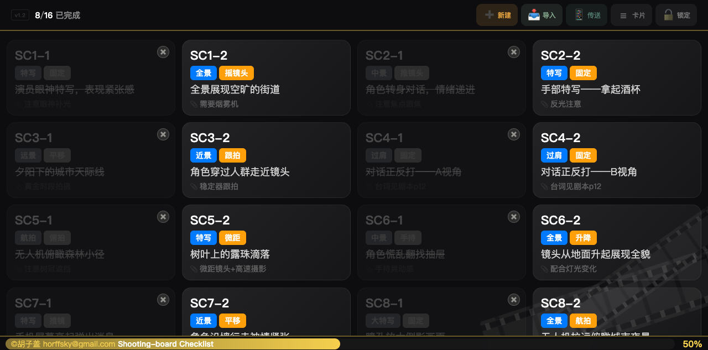
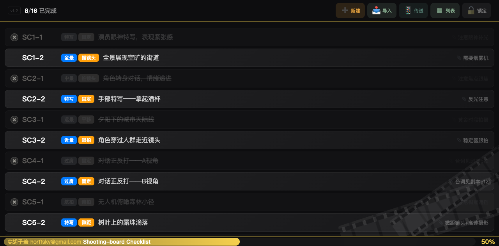
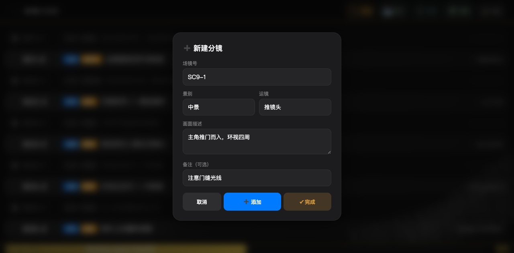
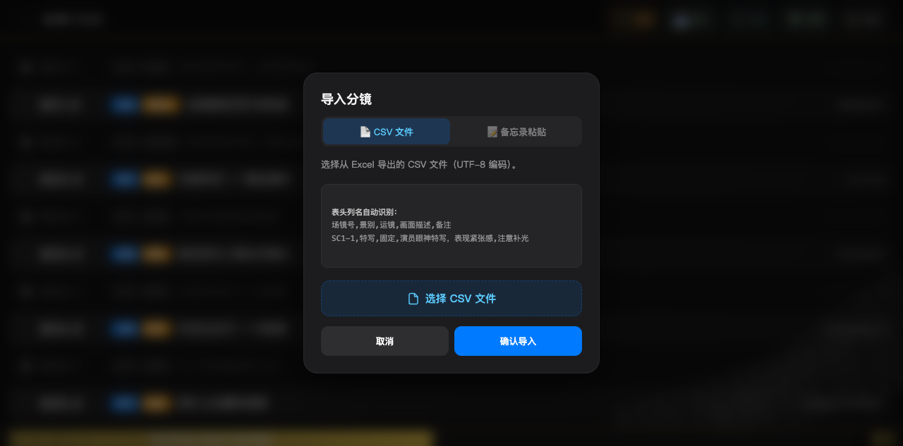
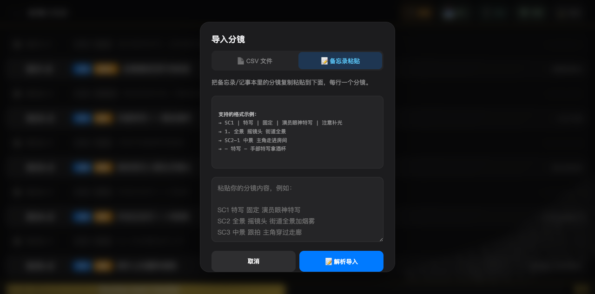
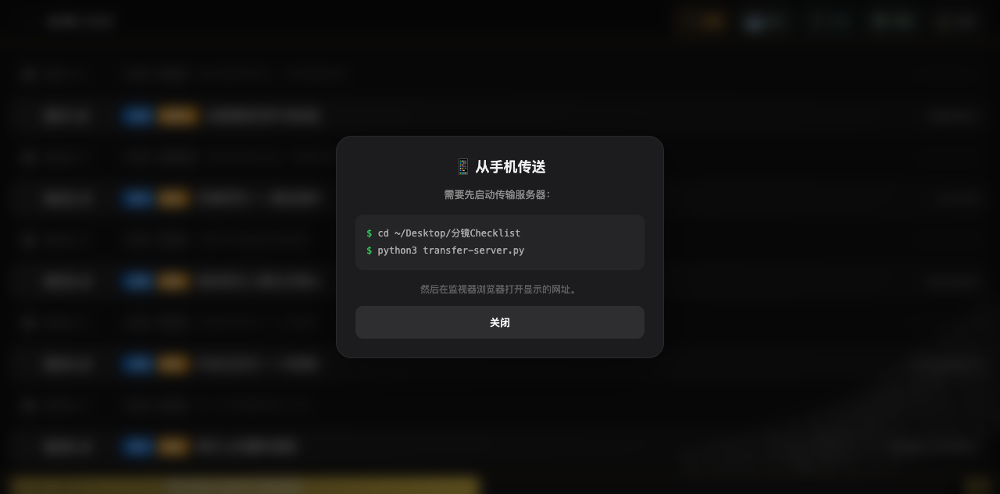
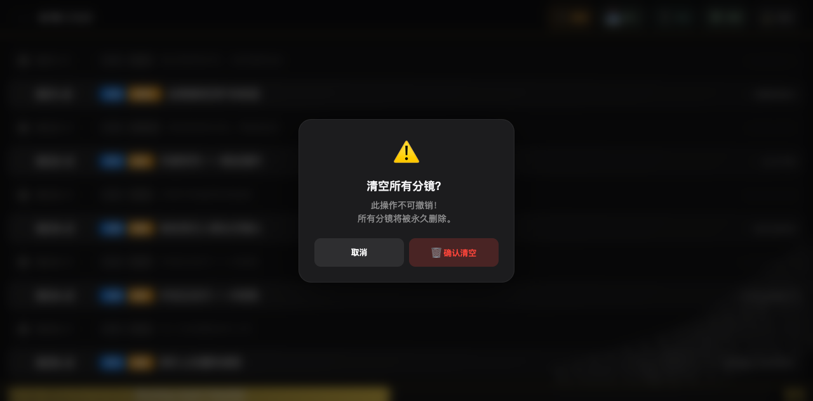

# 🎬 分镜Checklist / ShotCheck

**一款跑在安卓监视器上的分镜管理工具。**  
拍片时边监看画面、边对分镜、边划掉已拍——全在一块屏幕上搞定。

---

## 📱 支持平台

| 平台 | 方式 |
|------|------|
| 🖥️ **Accsoon M7 Pro / M7H Pro** | 安装 APK，原生全屏运行 |
| 📱 **安卓手机 / 平板** | 安装 APK 即可使用 |
| 💻 **电脑 / iPad** | 浏览器直接打开 `index.html` |
| 🔄 **跨设备传输** | 扫码从手机发分镜到监视器 |

无论你是在导演监视器前、在片场掏手机、还是在电脑前做计划——同一套分镜，随时同步。

---

## 🖼️ 预览

| 截图 | 说明 |
|------|------|
|  | **卡片模式** — 16个分镜网格展示，已完成卡片自动变黑白灰调，进度条 50% |
|  | **列表模式** — 一行一个分镜，场镜号·景别·运镜·描述·备注清晰排列 |
|  | **新建分镜** — 填写场镜号、景别下拉选、运镜下选、画面描述、备注，支持数字自动递增 |
|  | **导入 CSV** — 支持从 Excel 导出的 CSV 文件，自动识别各列名 |
|  | **备忘录粘贴** — 手机备忘录写的分镜直接粘贴，智能解析多种格式 |
|  | **扫码传输** — 启动服务器后，手机扫码即可发送分镜到监视器 |
|  | **清空确认** — 长按锁定按钮 3 秒弹出确认框，防止误操作 |

---

## 🚀 快速上手（30 秒）

1. 下载 [`ShotCheck.apk`](./ShotCheck.apk) 安装到监视器或安卓手机
2. 打开 App → 点击右上角 **📥 导入** → 选择 [`分镜示例.csv`](./分镜示例.csv)
3. 看到卡片后，**双击**任意卡片切换完成状态
4. 点击 **☰ 卡片** 切换到列表模式看看
5. 点击 **➕ 新建** 试试手写一个分镜
6. 搞定。剩下的自己摸索～

---

## ✨ 功能

| 功能 | 说明 |
|------|------|
| 🃏 **卡片/列表双模式** | 网格卡片或 Excel 式列表，自由切换 |
| 👆👆 **双击标记完成** | 已拍分镜自动变黑白灰调，进度条前进 |
| ➕ **直接新建** | 在监视器上手写分镜，数字 ID 自动递增 |
| 📥 **导入 CSV** | 从 Excel 导出分镜表，自动识别列名 |
| 📱 **扫码传输** | 手机备忘录粘贴分镜 → 扫码发送到监视器 |
| 📝 **粘贴解析** | 手机备忘录纯文本粘贴，智能识别多种格式 |
| 🔒 **锁定模式** | 防止片场误触 |
| 💾 **自动保存** | LocalStorage 持久化，待机断电不丢 |
| 🎞️ **底部进度条** | ≥85% 显示「加油」，100% 显示「❤️Proud of You❤️」 |
| 🗑️ **长按清空** | 长按锁定按钮 3 秒，确认后清空所有分镜 |

---

## 📥 安装

### 方式一：APK 安装（推荐）

下载 [`ShotCheck.apk`](./ShotCheck.apk)，在安卓监视器或手机上安装即可。

### 方式二：浏览器直接打开（电脑 / Pad）

双击 `index.html`，Chrome / Safari / Edge 均支持，无需安装。

### 方式三：扫码传输（从手机发送到监视器）

```bash
python3 transfer-server.py
```

终端会显示二维码和网址。手机扫码 → 粘贴备忘录内容 → 点发送，分镜自动出现在监视器上。

---

## 🧪 测试分镜

仓库附带了 [`分镜示例.csv`](./分镜示例.csv)，可以直接导入体验：

```csv
场镜号,景别,运镜,画面描述,备注
SC1-1,特写,固定,演员眼神特写，表现紧张感,注意眼神补光
SC1-2,全景,摇镜头,全景展现空旷的街道,需要烟雾机配合
SC2-1,中景,推镜头,角色转身对话，情绪递进,注意焦点跟焦
```

---

## 💻 技术栈

**纯前端单页应用，零依赖。**

- `index.html` 是一个文件搞定全部——HTML + CSS + JavaScript
- 数据存储：浏览器 LocalStorage（待机断电不丢）
- 扫码传输：`transfer-server.py`（Python 标准库，无需额外安装）
- 无框架、无构建工具、无 npm 包——下载就能用

---

## 🛠 自行构建 APK

```bash
# 环境：JDK 21 + Android SDK
export JAVA_HOME=~/homebrew/opt/openjdk@21/Contents/Home
export ANDROID_HOME=~/android-sdk

cd ShotCheck-apk
cp index.html src/
npx cap copy android
cd android
./gradlew clean assembleDebug
```

APK 输出：`android/app/build/outputs/apk/debug/app-debug.apk`

---

## 📋 更新日志

| 版本 | 日期 | 内容 |
|------|------|------|
| v1.2 | 2026.06 | 横屏适配、弹窗压缩、进度条嵌入版权、双击标记、激励语、大字号 |
| v1.1 | 2026.06 | 胶片装饰、Logo、列表模式、扫码传输 |
| v1.0 | 2026.06 | 初始版本：卡片/列表、CSV 导入、新建、锁定、自动保存 |

---

## 📄 文件说明

```
分镜Checklist/
├── index.html                  ← 主程序（核心，打开即用）
├── transfer-server.py          ← 扫码传输服务器
├── ShotCheck.apk               ← APK 安装包
├── 分镜示例.csv               ← 测试用分镜表
├── ss-01-cards.png             ← 截图：卡片模式（16分镜）
├── ss-02-list.png              ← 截图：列表模式
├── ss-03-newshot.png           ← 截图：新建分镜弹窗
├── ss-04-import.png            ← 截图：CSV 导入弹窗
├── ss-05-noteimport.png        ← 截图：备忘录粘贴弹窗
├── ss-06-phone.png             ← 截图：扫码传输弹窗
├── ss-07-confirm.png           ← 截图：清空确认弹窗
├── logo.svg                    ← Logo
├── README.md                   ← 本文档
└── .gitignore
```

---

## 👤 关于作者

**胡子盖**

纪录片导演 · 纪实摄影师 · B站知名UP主

- 🎥 B站空间：[space.bilibili.com/218610189](https://space.bilibili.com/218610189)
- 📧 邮箱：horffsky@gmail.com

这个 App 是我用 **AI Vibe Coding**（纯聊需求，AI 生成代码）做出来的。  
初衷很简单：片场需要一个不掏手机、不翻纸、在监视器上就能管分镜的东西。  
如果你觉得有用，欢迎下载、分享、提建议。

**©胡子盖 horffsky@gmail.com · Shooting-board Checklist**  
免费使用，欢迎分享。
